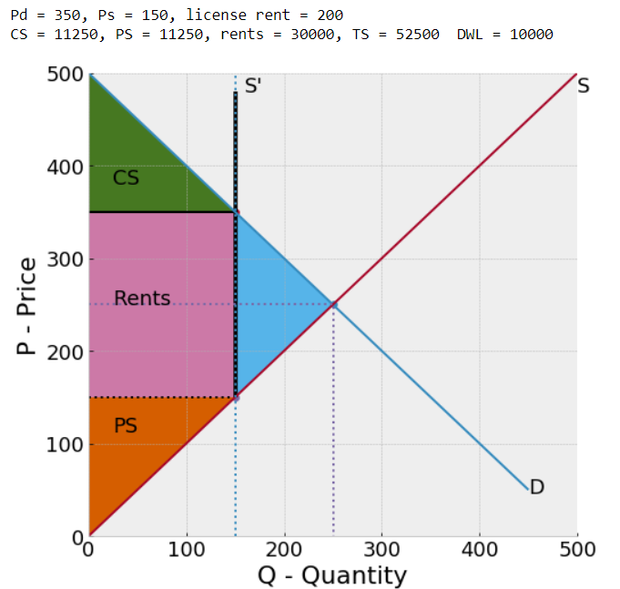

# Teaching Economics with jupyter notebooks

A slowly growing repository for jupyter notebooks that I have used for teaching economics at Hunter College and The Graduate Center at CUNY, and elsewhere. 

There are a couple of ways to explore this content interactively
- Easiest. Try the [web app](https://ricardian.herokuapp.com/) version of the content (hosted on heroku). Code is hidden. 
- Run the notebooks on a jupyter server on your own machine or in the cloud via the launch-binder button

   

These Jupyter Notebooks vary in quality from crude to more polished. I've organized them loosely into notebooks sub-folders

- [intro](notebooks/intro)  -- Eco 100 and Eco 200 Intro to micro

- [Trade](notebooks/trade)  -- Eco 340 and Eco 740 Trade models

- [micro](notebooks/micro)  -- Eco 701 Micro Theory models

- [epidemic](notebooks/epidemic)  -- because economists are trying to learn epidemiology

Notebooks for other courses (housed at other repositories):

- [PhD Development seminar](https://dev-ii-seminar.readthedocs.io/en/latest/index.html)  -- PhD development seminar at The Graduate Center

- [Land property rights](https://github.com/jhconning/land_uct_2019)  -- for a short course on political economy of land in Cape Town 2019

