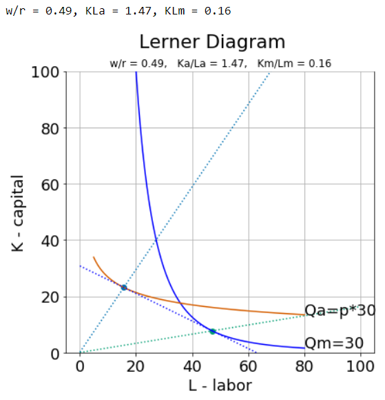

# Jupyter Notebooks for Trade Models

Here is a collection of [jupyter notebooks](https://jupyter.org/) that build and describe a few key models taught in international trade courses. Some notebooks are relatively complete and polished, others are more like first drafts, but all try to explain and interactively animate key graphical presentations of these classic trade models using the interactive HTML widgets such as sliders (using the [ipywidgets](https://github.com/jupyter-widgets/ipywidgets) library). 

These notebooks may be simply viewed (just click on links above). If you plan to run these notebooks interactively 
(which I recommend so that you can change the value of model parameters with sliders and see how graphs change) using 
the Microsoft Azure notebooks [mirror of this repository](https://notebooks.azure.com/jhconning/projects/econ-teach/tree/trade) 
cloud server or a jupyter notebook server running on your own machine do be aware that some of the code works only if your
python installation is python 3.5 or above.  

Here are brief instructions for running notebooks on the Microsoft Azure notebook cloud server:
1. You will need to create your own (free) account in order to execute notebooks (this also allows 
you to clone the repository to your account where you will be free to make and save changes).
2. Open the notebook you want to execute.
3. From the _Kernel menu chose _Change_Kernel and set it to python 3.6 (or higher).
4. Most of the notebooks place the python code for making graphs and simulations in a **Code Section** toward 
the bottom of the notebook. Execute all cells starting in that section (place your cursor in the Code Section cell 
and then go to the _Cell menu and _Run_all_Below); then return to the top of the notebook and re-execute any cells needed to
display graphs or produce other results by placing your cursor in the cell and pressing shift-enter to execute.
